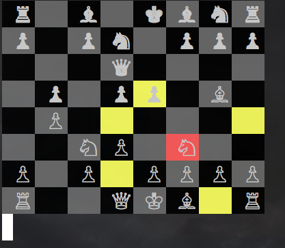

# Ruby Chess

## Features

- [x] Deep duplication of board enables the simulation of next move for validation
- [x] Uses cursorable library to highlight possible moves upon piece selection

# To-Dos

- [x] Add AI Computer player
- [x] Implement saving

# Instructions for playing

Navigate to the lib directory from the command line, and run:

 'ruby game.rb'

Use the arrow keys to scroll, and spacebar to select and place a piece.
The clear pieces start!

this is change 1!!
